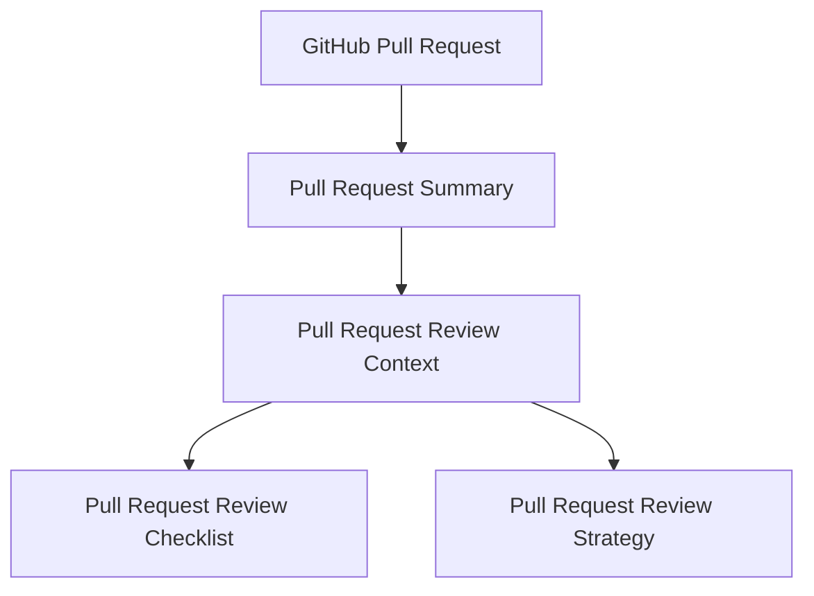
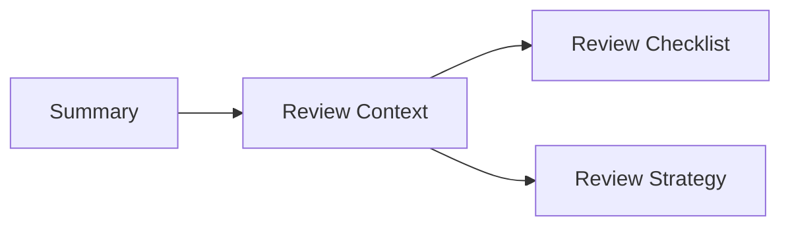
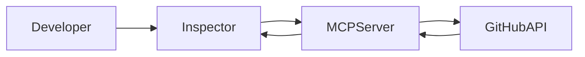
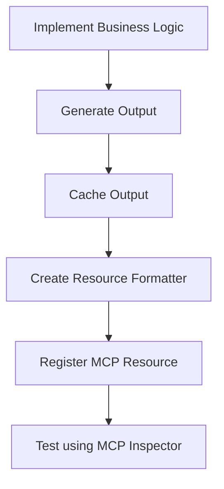
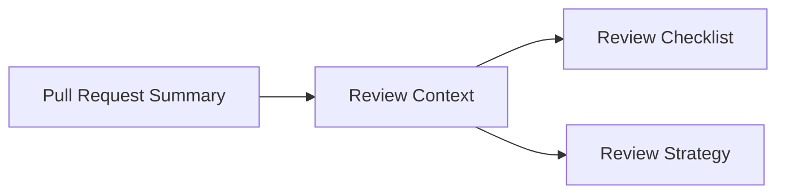
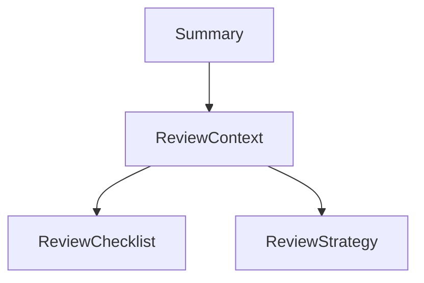
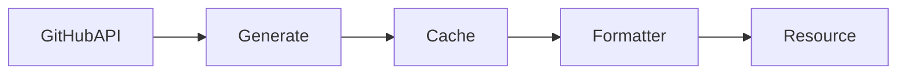

# GitHub Engineering Assistant MCP

> A Model Context Protocol (MCP) server that transforms GitHub Pull Requests into engineering-oriented review artifacts.

---

# Overview

GitHub Engineering Assistant MCP is a Model Context Protocol (MCP) server designed to help Large Language Models (LLMs) perform high-quality Pull Request reviews.

Instead of exposing raw GitHub API responses, the server progressively transforms Pull Request data into structured engineering knowledge.

Each generated resource answers a specific engineering question and builds upon previously generated information.

The result is a review pipeline capable of guiding an LLM through the entire review process—from understanding what changed to determining the best review order.

---

# Features

- Pull Request engineering summaries
- Context-aware review guidance
- Automated review checklists
- Recommended review strategy
- GitHub API integration
- Intelligent resource caching
- Modular architecture
- MCP Resource support
- MCP Tool support
- Structured outputs optimized for LLM consumption

---

# Architecture Overview



---

# Resource Pipeline

Each resource is responsible for answering a single engineering question.



The generated knowledge evolves progressively.

| Resource | Engineering Question |
|------------|-------------------------|
| Pull Request Summary | What changed? |
| Review Context | Where should I focus? |
| Review Checklist | What should I verify? |
| Review Strategy | In which order should I review? |

Each resource consumes only the information required from the previous stage.

This design avoids duplicated business logic while keeping every resource independent and reusable.

---

# Why this project exists

GitHub provides excellent APIs for retrieving Pull Request information.

However, those APIs expose **raw development data**, not **engineering knowledge**.

For example, GitHub can easily tell you:

- changed files
- additions
- deletions
- commits
- labels

But it cannot answer questions such as:

- What are the most important engineering impacts?
- Which areas deserve additional attention?
- What should the reviewer verify?
- In which order should the review be performed?

GitHub Engineering Assistant MCP fills this gap by generating progressively richer review artifacts that help both engineers and LLMs perform more efficient code reviews.

---

# Design Principles

This project follows a few architectural principles.

## Single Responsibility

Each resource exists for one purpose only.

Instead of creating one large resource containing every possible insight, the project is divided into multiple specialized resources.

This keeps every artifact small, reusable and easy to evolve.

---

## Progressive Knowledge

Resources build upon previous resources.

Instead of recalculating GitHub information multiple times, each resource enriches previously generated knowledge.

---

## Engineering-Oriented Outputs

The project intentionally avoids exposing GitHub REST responses directly.

Instead, every generated resource is designed around software engineering workflows.

The objective is to provide information that helps during Pull Request reviews rather than simply mirroring GitHub endpoints.

---

## Reusable Context

Every generated resource can be consumed independently.

At the same time, resources are designed to serve as inputs for more advanced resources.

For example:

- Review Context depends on Summary
- Review Checklist depends on Review Context
- Review Strategy depends on Review Context

This layered approach minimizes duplicated logic while maximizing reuse.

---

# Technology Stack

- TypeScript
- Node.js
- Model Context Protocol SDK
- GitHub REST API
- Axios
- Zod

---

# Getting Started

## Prerequisites

Before running the project, make sure you have the following installed:

- Node.js 20+
- npm
- A GitHub Personal Access Token (PAT)
- GitHub API URL

---

# Installation

Clone the repository:

```bash
git clone <repository-url>
```

Navigate to the project directory:

```bash
cd github-engineering-assistant-mcp
```

Install the project dependencies:

```bash
npm install
```

---

# Environment Variables

Create a `.env` file in the project root.

```env
GITHUB_TOKEN=your_personal_access_token
GITHUB_API_URL=https://api.github.com
```

## GitHub Token

The server authenticates every GitHub request using a Personal Access Token.

Depending on which resources you want to access, your token should have permission to:

- Read repositories
- Read Pull Requests
- Read Issues
- Read Commit history

For public repositories, read permissions are generally sufficient.

---

# Running the Server

The project provides a development script that launches the MCP Server together with the MCP Inspector.

```bash
npm run inspect:dev
```

This command will:

- Build the project (if necessary)
- Start the MCP Server
- Open the MCP Inspector
- Allow testing Resources and Tools interactively

Once the Inspector is running, you can browse all registered Resources, invoke Tools, and inspect generated outputs.

---

# Using the MCP Inspector

The MCP Inspector is the primary way to test the server during development.

It allows you to:

- Browse registered Resources
- Execute Tools
- Inspect generated outputs
- Validate resource templates
- Verify structured responses
- Debug resource generation

Typical workflow:



---

# Project Structure

The project is organized into small, focused modules.

```text
src/
├── cache/
├── formatters/
├── integrations/
├── resources/
├── services/
├── tools/
├── types/
├── utils/
└── server.ts
```

---

# Folder Responsibilities

## cache/

Responsible for storing generated artifacts.

Each cached value stores:

- generated output
- generation timestamp

Resources always attempt to retrieve cached information before generating new content.

---

## formatters/

Responsible for converting structured objects into human-readable Resource outputs.

Examples:

- Pull Request Summary Resource
- Review Context Resource
- Review Checklist Resource
- Review Strategy Resource

The formatting layer never performs business logic.

---

## integrations/

Contains all communication with external systems.

Currently:

- GitHub REST API

Business rules should never be implemented inside this layer.

---

## resources/

Contains every registered MCP Resource.

Resources expose generated engineering artifacts to LLMs.

Examples:

- Pull Request Summary
- Review Context
- Review Checklist
- Review Strategy

---

## services/

Contains the project's business logic.

Services are responsible for:

- retrieving GitHub data
- generating engineering insights
- composing outputs
- orchestrating caches

Whenever possible, resources delegate work to services.

---

## tools/

Contains MCP Tools.

Tools are used for actions or structured operations, while Resources expose reusable contextual knowledge.

---

## types/

Contains shared TypeScript models.

The project distinguishes between two different concepts:

- Output
- Value

This separation keeps cached metadata independent from business outputs.

A more detailed explanation is provided later in this document.

---

## utils/

Contains reusable utilities.

Examples include:

- builders
- mappings
- helper functions
- formatting helpers

Utilities should remain generic and reusable across the project.

---

# Naming Convention

Files follow a domain-oriented naming convention.

Examples:

```text
pull-request-summary.resource.ts

pull-request-summary.cache.ts

pull-request-summary.formatter.ts

pull-request-review-context.resource.ts

pull-request-review-checklist.resource.ts

pull-request-review-strategy.resource.ts
```

This convention groups related files together and makes navigation easier as the project grows.

---

# Project Philosophy

Instead of organizing files by technical concern only, the project groups components by engineering domain.

For example, every Pull Request Summary component shares the same prefix:

```text
pull-request-summary.*
```

This allows developers to quickly locate all files related to the same feature.

---

# Development Workflow

The typical development flow is:



This workflow keeps every new resource consistent with the existing project architecture.

---

# Resources

The GitHub Engineering Assistant MCP is centered around **Resources**.

Unlike Tools, which perform actions, Resources expose reusable engineering knowledge that can be consumed by LLMs multiple times during a conversation.

Each resource has a single responsibility and progressively enriches the Pull Request analysis.



---

# Pull Request Summary

URI

```text
github://summary-pull-request/{owner}/{repositoryName}/{pullRequestNumber}
```

---

## Purpose

The Pull Request Summary is the foundation of the entire review pipeline.

Its responsibility is to transform raw GitHub Pull Request data into structured engineering insights.

Rather than exposing GitHub REST responses directly, this resource identifies the engineering impact of the Pull Request.

---

## Generated Information

The summary includes:

- Pull Request metadata
- Engineering impact summary
- Risks
- Recommendations
- Pull Request metrics
- Commit insights
- File categorization
- Changed files
- Generation timestamp

---

## Engineering Question

This resource answers:

> **What changed?**

---

## Why it exists

GitHub exposes low-level information such as commits, files and additions.

The Summary converts those raw details into engineering-oriented information that is easier for both humans and LLMs to understand.

---

# Pull Request Review Context

URI

```text
github://pull-request-review-context/{owner}/{repositoryName}/{pullRequestNumber}
```

---

## Purpose

The Review Context builds upon the Pull Request Summary.

Instead of describing what changed, it identifies where reviewers should focus their attention.

---

## Generated Information

The resource generates two sections.

### Review Focus

High-level engineering areas that deserve additional attention.

Examples:

- Verify cache consistency
- Review business logic
- Validate formatting behavior
- Review exposed resources

---

### Review Signals

Additional observations detected during the analysis.

Examples:

- No test files were modified
- Large number of changed files
- Source code changed without documentation updates

---

## Engineering Question

This resource answers:

> **Where should I focus my review?**

---

## Why it exists

Understanding what changed is only the first step.

The Review Context transforms engineering impacts into review priorities.

---

# Pull Request Review Checklist

URI

```text
github://review-checklist/{owner}/{repositoryName}/{pullRequestNumber}
```

---

## Purpose

The Review Checklist converts the Review Focus into actionable review tasks.

Instead of telling reviewers where to look, it tells them what to verify.

---

## Generated Information

Examples:

- Validate cache invalidation logic
- Verify cache key generation
- Review GitHub API integration
- Validate output formatting
- Confirm resource URI templates

---

## Engineering Question

This resource answers:

> **What should I verify?**

---

## Why it exists

Review Focus remains conceptual.

The checklist transforms engineering concepts into concrete validation items.

---

# Pull Request Review Strategy

URI

```text
github://review-strategy/{owner}/{repositoryName}/{pullRequestNumber}
```

---

## Purpose

The Review Strategy suggests the recommended order for reviewing the Pull Request.

It does **not** introduce new review items.

Instead, it organizes the detected review areas into a logical engineering workflow.

---

## Generated Information

Typical output:

1. Review business logic
2. Validate cache behavior
3. Inspect shared utilities
4. Validate formatting
5. Review exposed resources

---

## Engineering Question

This resource answers:

> **In which order should I perform the review?**

---

## Why it exists

Developers naturally understand software by moving from business logic toward implementation details.

Reviewing files in the order they were modified is often inefficient.

The Review Strategy recommends a logical review order based on engineering priorities.

---

# Resource Dependencies

Each resource builds upon previously generated knowledge.



This design prevents duplicated business logic while keeping every resource independent.

---

# Resource Responsibilities

| Resource | Responsibility |
|------------|----------------|
| Pull Request Summary | Describe what changed |
| Review Context | Identify where attention should be focused |
| Review Checklist | Generate actionable validation tasks |
| Review Strategy | Recommend the review order |

Each resource answers exactly one engineering question.

---

# Why multiple resources?

One large resource could contain every piece of information.

Instead, the project intentionally separates responsibilities.

Benefits include:

- simpler outputs
- reusable context
- easier maintenance
- lower coupling
- progressive knowledge generation
- better LLM consumption

This architecture allows each resource to evolve independently while remaining part of the overall review pipeline.

---

# Resource Lifecycle

Every resource follows the same lifecycle.



This consistent architecture makes it straightforward to add new engineering resources in the future.
